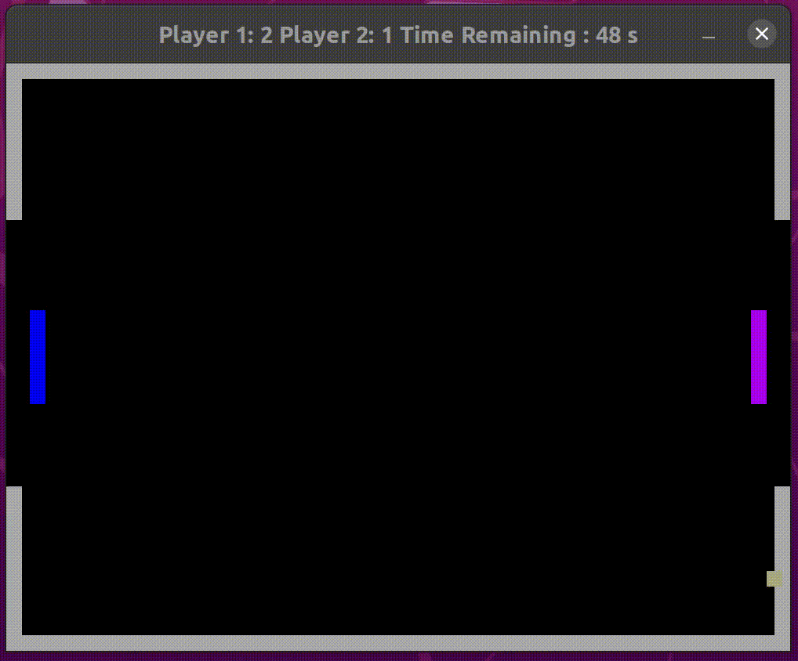

# C++ Nanodegree Final Project: Two person Pong Game

This is an implementation of the Pong game. The following resources provided inspiration and guidance for the implementation.

* [https://github.com/BassLC/Pong/blob/master/pong.cpp](https://github.com/BassLC/Pong/blob/master/pong.cpp)
* [https://github.com/gameprogcpp/code/blob/master/Chapter01/Game.cpp](https://github.com/gameprogcpp/code/blob/master/Chapter01/Game.cpp)
* [https://www.youtube.com/watch?v=DeKfZhwyFO4](https://www.youtube.com/watch?v=DeKfZhwyFO4)

## Dependencies for Running Locally
* cmake >= 3.7
  * All OSes: [click here for installation instructions](https://cmake.org/install/)
* make >= 4.1 (Linux, Mac), 3.81 (Windows)
  * Linux: make is installed by default on most Linux distros
  * Mac: [install Xcode command line tools to get make](https://developer.apple.com/xcode/features/)
  * Windows: [Click here for installation instructions](http://gnuwin32.sourceforge.net/packages/make.htm)
* SDL2 >= 2.0
  * All installation instructions can be found [here](https://wiki.libsdl.org/Installation)
  >Note that for Linux, an `apt` or `apt-get` installation is preferred to building from source. 
* gcc/g++ >= 5.4
  * Linux: gcc / g++ is installed by default on most Linux distros
  * Mac: same deal as make - [install Xcode command line tools](https://developer.apple.com/xcode/features/)
  * Windows: recommend using [MinGW](http://www.mingw.org/)

## Basic Build Instructions

1. Clone this repo.
2. Make a build directory in the top level directory: `mkdir build && cd build`
3. Compile: `cmake .. && make`
4. Run it: `./Pong`.

## Play Instructions

This is a two player implementation of the Pong game. As seen in the GIF above Player 1 is to the left and Player 2 is to the right. Player 1 can move up and down respectively using "W" and "S" keys while Player 2 can move up and down respectively using "UP" and "DOWN" keys. You can also change some of the game specs readily by changing the following parameters in the [/src/sim_config.txt](https://github.com/prasadshingne/CppND-Capstone/blob/master/src/sim_config.txt) file.

Default parameter values - 

* window width=1000 // play window width in pixels
* window height=750 // play window height in pixels
* line thickness=20 // line thickness in pixels
* player height=120 // player 1 and 2 height in pixels
* simulation runtime=60 // game run time in seconds
* ball X velocity=-200.0f // ball velocity in x direction in pixels per second
* ball Y velocity=200.0f // ball velocity in y directio in pixels per second

More game parameters can be changed in - 

* Ball and player motion - [/src/pSim.cpp](https://github.com/prasadshingne/CppND-Capstone/blob/master/src/pSim.cpp)
* Background and goal specification - [/src/pRenderer.cpp](https://github.com/prasadshingne/CppND-Capstone/blob/master/src/pRenderer.cpp)

## File Structure

## Rubric Points

### README (All Rubric Points REQUIRED)

### Compiling and Testing (All Rubric Points REQUIRED)

### Loops, Function, I/O

### Object Oriented Programming

### Memory Management

